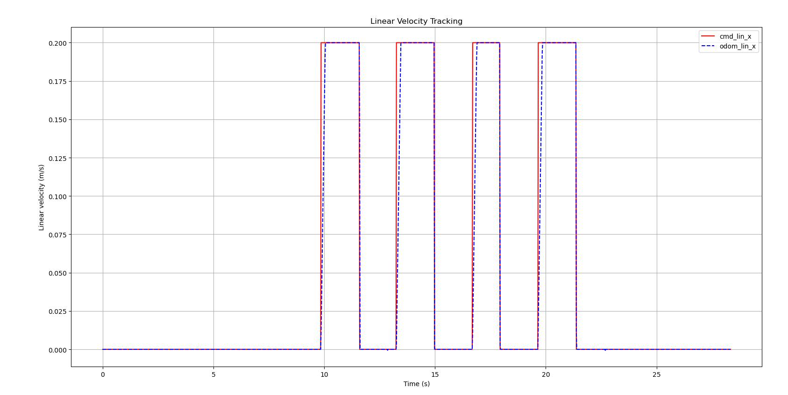
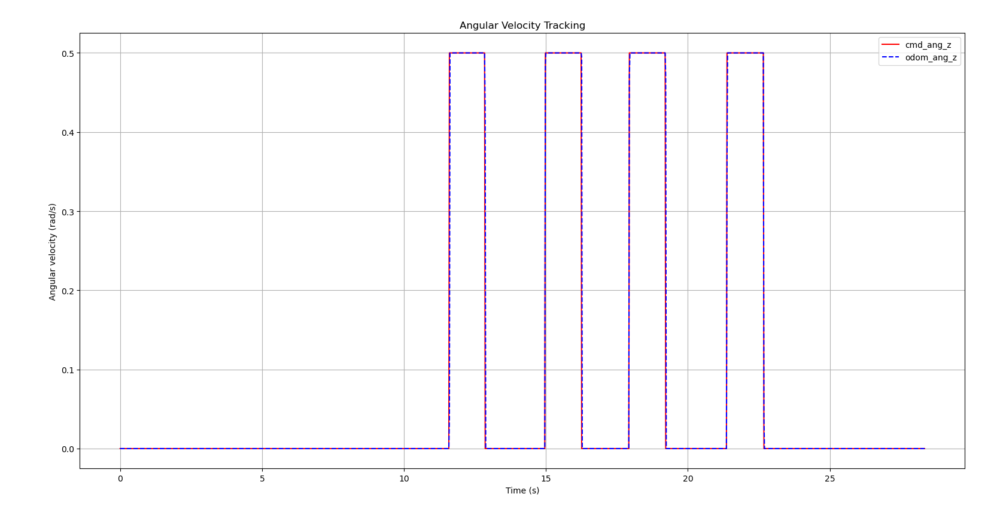
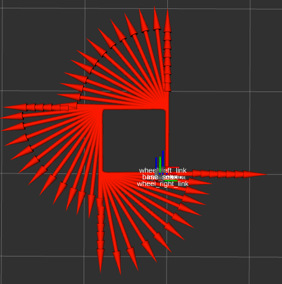

# Lab 3 Report

## Plots & Visualizations
**Open-loop vs. odometry path**

**PD trajectory vs. commanded path**

**Wall-following behavior**

**/odom vs. /odometry/filtered vs. /gazebo/model_states**

**RViz**

Part 2

## Tehnical Report
**Methods: how you implemented each part (logger, PD, PID, EKF).**

**Results: trajectory plots, screenshots, performance observations.**

**Comparisons: open-loop vs. closed-loop, /odom vs. /odometry/filtered.**

**Controller tuning: how you chose/tuned Kp, Ki, Kd.**

**Challenges: problems encountered and how you solved them.**

**Division of labor: who did what in the group (coding, plotting, writing, debugging, etc.). Confirmation that all members participated and understand the work.**

## Reflection Questions
**Part 1: Odometry and Open-Loop**

How did your robot’s actual odometry path compare to the commanded open-loop square? Where did you see drift or deviation? What factors caused the robot to deviate (simulation noise, wheel slip, etc.)?

Why does dead-reckoning (open-loop odometry) accumulate error over time?

**Part 2: Closed-Loop PD Control**

What effect did changing Kp and Kd have on the robot’s ability to follow waypoints? Give an example of one tuning attempt that worked well and one that caused instability.

Why is angle wrap-around handling (constraining yaw error to (-\pi,\pi]) necessary in your controller?

**Part 3: PID Wall Following**

How does the lookahead distance L affect wall-following performance? What happens with very small vs. very large values?

When would adding integral gain Ki be useful in wall following? Did you find you needed it in this lab? Why or why not?

**Part 4: State Estimation (EKF)**

In your plots, how did /odometry/filtered compare to /odom and the Gazebo ground truth? Did the EKF reduce drift? Were there situations where the filter underperformed?

Why is it beneficial to fuse wheel odometry and IMU, rather than relying on one sensor alone?

**Group Reflection**

As a team, what was the biggest challenge you faced in this lab? How did you overcome it? What would you do differently if you had to repeat the project?

What did you learn about the importance of feedback control and state estimation in robotics?
