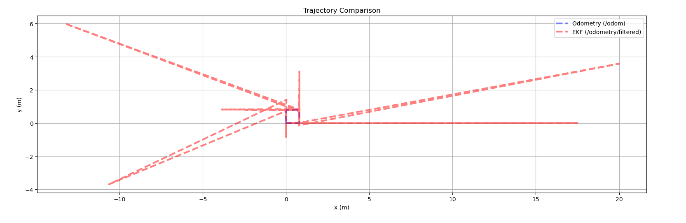

# Lab 3 Report

## Plots & Visualizations

**Open-loop vs. odometry path**
-1.png)

**PD trajectory vs. commanded path**

**Wall-following behavior**

**/odom vs. /odometry/filtered vs. /gazebo/model_states**

**RViz**

Part 2

## Tehnical Report
**Methods: how you implemented each part (logger, PD, PID, EKF).**

Logger: 

I implemented an odometry logger node (odom_logger.py) that subscribes to both /odom (for measured velocities) and /cmd_vel (for commanded velocities). The node logs timestamp, odom_lin_x, odom_ang_z, cmd_lin_x, and cmd_ang_z into a CSV file.

Each message callback stores the most recent readings in variables, and a timer periodically writes synchronized data rows to disk. This allowed for later comparison of commanded versus measured motion.

To visualize performance, I wrote plot_odom.py and compare_plot.py scripts using matplotlib to plot:
Odometry vs. Ideal Path (open-loop drift)
Commanded vs. Odometry Linear Velocity
Commanded vs. Odometry Angular Velocity

**Results: trajectory plots, screenshots, performance observations.**

**Comparisons: open-loop vs. closed-loop, /odom vs. /odometry/filtered.**

In open-loop mode, the robot was driven using timed velocity commands to trace a square. The Odometry vs Ideal Path plot showed drift accumulating over each leg and how the square gradually became distorted. This is expected because open-loop control does not correct for wheel slip, latency, or noise in wheel encoder measurements.

**Controller tuning: how you chose/tuned Kp, Ki, Kd.**

First, I decreased the value of Kp, because the robot was moving too erratically. I noticed that the robot would move towards the obstacles in the middle instead of towards the right-hand wall, which meant I also had to decrease the Kd so there was less overturning. I initially had Ki at 0.0, and I had kept it at that value for the right-wall turning. I had to do a lot of trial and error and slowly increased/decreased each of the values. If the robot didn't rotate enough towards the wall, that meant I had to increment Kp and Kd accordingly. If the robot was overadjusting and oscillating quickly while turning, that meant I had to decrease Kp and Kd. For the left-turning, I used a small amount of Ki (0.01) because I noticed that for the left wall, the robot was more prone to turning too much; Ki helped correct some of the error over time. In addition to modifying these values, I flipped the geometry angles so one robot beam was facing left, the other beam was facing northwestward. I also flipped the values of getting the error, because I realized that when the error was positive, the robot would turn towards the right. When the value was negative, the robot would then move towards the left, which is what I needed for the left-turning modification. My end result isn't completely perfect, as the robot does sometimes oscillate back and forth to correct itself, but I managed to get the robot to make smooth turns around the turtle's perimeter.

**Challenges: problems encountered and how you solved them.**

The biggest challenge our team faced in this lab was getting the robot to accurately follow the commanded path while accounting for real-world sensor noise and odometry drift. Initially, our PD controller often overshot or failed to reach waypoints precisely, and the logged trajectories showed noticeable discrepancies between the commanded path, odometry readings, and Gazebo ground truth. We addressed this by carefully tuning the PD gains for both linear and angular velocities, adding a derivative term for angular control to reduce oscillations, and implementing a small slowdown when the robot needed to turn sharply. Logging odometry, filtered estimates, and ground truth helped us visually analyze errors and iteratively refine the controller and waypoint strategy.
Another challenge arose in Part 4, where the graph did not display Ground Truth points. After thorough testing, we realized the template code was not compatible with ROS 2, as Model_States was no longer a supported topic. We attempted to use the /tf topic for Ground Truth instead, but ran out of time to fully test this solution. Additionally, the graphs were often inconsistent between runs, with trends sometimes missing entirely, and resetting devices did not resolve the issue, preventing us from generating a correct and reliable result.

**Division of labor: who did what in the group (coding, plotting, writing, debugging, etc.). Confirmation that all members participated and understand the work.**
Lameya: Completed part 1 and worked on part 2 partially. 
Patrick: Completed part 2 and worked part 4 partially.
Lina: Completed part 3.

## Reflection Questions
**Part 1: Odometry and Open-Loop**

How did your robot’s actual odometry path compare to the commanded open-loop square? Where did you see drift or deviation? What factors caused the robot to deviate (simulation noise, wheel slip, etc.)?

The commanded open-loop path was a perfect square but the robot's actual odometry path deviates significantly from the square in several ways. The most obvious deviation is the rounded corners instead of sharp 90° turns, indicating that the robot executed turns with finite angular velocity rather than instantaneous rotations. The path also fails to close properly and does not return to the origin which demonstrates accumulated odometry drift. Additionally, the executed square is asymmetric and distorted, appearing wider than it is tall. These deviations likely stem from multiple factors including wheel slip during turns, odometry integration errors that compound over time and simulation-specific issues like added sensor noise. The cumulative effect shows how open-loop control without feedback correction leads to significant position errors, especially after multiple turns where small errors in each movement accumulate throughout the trajectory.

Why does dead-reckoning (open-loop odometry) accumulate error over time?

Dead-reckoning computes the robot’s position based solely on wheel encoder data and motion commands, without external correction. Each estimate depends on the previous one, so any small error in velocity, orientation, or distance traveled gets carried forward. Over time, these errors compound which causes the estimated position to drift further from the true location. Essentially, odometry errors integrate over time, leading to growing inaccuracy the longer the robot runs without correction from external sensors like LIDAR.

**Part 2: Closed-Loop PD Control**

What effect did changing Kp and Kd have on the robot’s ability to follow waypoints? Give an example of one tuning attempt that worked well and one that caused instability.

Why is angle wrap-around handling (constraining yaw error to (-\pi,\pi]) necessary in your controller?

Angle wrap-around handling is necessary in the controller because yaw angles are periodic and naturally wrap around at ±π. Without it, calculating the difference between the robot’s current heading and the goal can produce misleading results, causing the controller to command unnecessarily large rotations. For example, if the robot’s current yaw is near +pi and the goal is near -pi, a naive subtraction would indicate a rotation of almost 2π radians, even though the robot only needs to turn a small angle in the opposite direction. By constraining the yaw error to the interval (-pi,pi], the controller always computes the shortest rotation direction and magnitude, ensuring efficient, stable, and predictable motion toward the goal. This prevents overshooting, oscillations, and excessive angular commands, which are critical for accurate and smooth navigation.

**Part 3: PID Wall Following**

How does the lookahead distance L affect wall-following performance? What happens with very small vs. very large values?

The lookahead distance affects wall-following performance, because it affects how the robot oscillates in relation to incoming obstacles or walls. I noticed when the lookahead distance was very small, the robot would move erratically, meaning it would rotate back and forth to the point where it would spazz out and glitch around the environment. When the lookahead distance was very large, the robot would have very slow turning, to the point where it was not properly reacting to incoming walls. For me, the robot would end up crashing into the wall, and the RViZZ sensor would show some turning movement being attempted, but because it hit the wall, the robot began to drift off it's predicted course.

When would adding integral gain Ki be useful in wall following? Did you find you needed it in this lab? Why or why not?

Adding Ki would be useful in wall following, as it helps account for errors that cannot be corrected by modifying Kp and Kd. I used a very small amount (0.01) to help the robot navigate around the walls better for left-turning, because I noticed at the start and middle points of wrapping around the turtle, it would be a little far from the wall than intended. Once I added Ki, the robot adjusted better so that it was closer to the wall and made slightly better turns.

**Part 4: State Estimation (EKF)**

In your plots, how did /odometry/filtered compare to /odom and the Gazebo ground truth? Did the EKF reduce drift? Were there situations where the filter underperformed?

In our plots, we were unable to generate a graph including all three trends because model_states is no longer supported in ROS 2, and we did not have enough time to implement a full workaround. However, from the available plot comparing /odometry/filtered and /odom, the two largely overlapped during straight segments of the square path, indicating that the EKF did reduce drift. After turns, however, the filter appeared to underperform when adjusting angles, suggesting that it was less effective at correcting rotational errors in those situations.

Why is it beneficial to fuse wheel odometry and IMU, rather than relying on one sensor alone?

Fusing wheel odometry and IMU is advantageous because each sensor has inherent limitations when used alone. Wheel odometry is effective for measuring short-term displacement but accumulates error over time due to wheel slippage and encoder drift. IMU measurements, on the other hand, provide accurate rotational data and quick responsiveness but are inherently noisy, and integrating them over time can increase drift. By combining both sensors using an Extended Kalman Filter (EKF), the system produces a more reliable estimate of the robot’s pose, reducing both the drift seen in odometry and the noise present in raw IMU data.

**Group Reflection**

As a team, what was the biggest challenge you faced in this lab? How did you overcome it? What would you do differently if you had to repeat the project?

In our plots, we were unable to generate a graph including all three trends because model_states is no longer supported in ROS 2, and we did not have enough time to implement a full workaround. However, from the available plot comparing /odometry/filtered and /odom, the two largely overlapped during straight segments of the square path, indicating that the EKF did reduce drift. After turns, however, the filter appeared to underperform when adjusting angles, suggesting that it was less effective at correcting rotational errors in those situations.

What did you learn about the importance of feedback control and state estimation in robotics?

This lab highlighted the critical importance of feedback control and state estimation in robotics. Feedback control allows the robot to correct for errors in real time, compensating for disturbances and imperfect actuators. State estimation, like the EKF, is essential for combining noisy sensor data into a coherent picture of the robot’s position and orientation. Without accurate state estimates, even a well-designed controller may fail to track the desired path. Together, they demonstrate how perception and control must work hand-in-hand for reliable autonomous navigation.