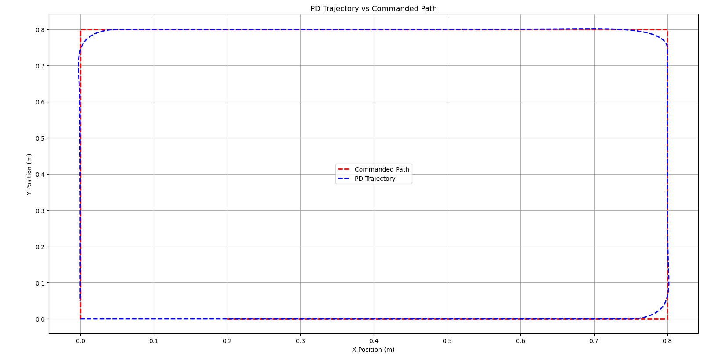

# Lab 3 Report

## Plots & Visualizations

**Open-loop vs. odometry path**
-1.png)

**PD trajectory vs. commanded path**

**Wall-following behavior**

**/odom vs. /odometry/filtered vs. /gazebo/model_states**

**RViz**

Part 2

## Tehnical Report
**Methods: how you implemented each part (logger, PD, PID, EKF).**
Logger: 
I implemented an odometry logger node (odom_logger.py) that subscribes to both /odom (for measured velocities) and /cmd_vel (for commanded velocities). The node logs timestamp, odom_lin_x, odom_ang_z, cmd_lin_x, and cmd_ang_z into a CSV file.

Each message callback stores the most recent readings in variables, and a timer periodically writes synchronized data rows to disk. This allowed for later comparison of commanded versus measured motion.

To visualize performance, I wrote plot_odom.py and compare_plot.py scripts using matplotlib to plot:
Odometry vs. Ideal Path (open-loop drift)
Commanded vs. Odometry Linear Velocity
Commanded vs. Odometry Angular Velocity

**Results: trajectory plots, screenshots, performance observations.**

**Comparisons: open-loop vs. closed-loop, /odom vs. /odometry/filtered.**
In open-loop mode, the robot was driven using timed velocity commands to trace a square. The Odometry vs Ideal Path plot showed drift accumulating over each leg and how the square gradually became distorted. This is expected because open-loop control does not correct for wheel slip, latency, or noise in wheel encoder measurements.

**Controller tuning: how you chose/tuned Kp, Ki, Kd.**

**Challenges: problems encountered and how you solved them.**

**Division of labor: who did what in the group (coding, plotting, writing, debugging, etc.). Confirmation that all members participated and understand the work.**
Lameya: Worked on part 1 and part 2 partially. 

## Reflection Questions
**Part 1: Odometry and Open-Loop**

How did your robot’s actual odometry path compare to the commanded open-loop square? Where did you see drift or deviation? What factors caused the robot to deviate (simulation noise, wheel slip, etc.)?

The commanded open-loop path was a perfect square but the robot's actual odometry path deviates significantly from the square in several ways. The most obvious deviation is the rounded corners instead of sharp 90° turns, indicating that the robot executed turns with finite angular velocity rather than instantaneous rotations. The path also fails to close properly and does not return to the origin which demonstrates accumulated odometry drift. Additionally, the executed square is asymmetric and distorted, appearing wider than it is tall. These deviations likely stem from multiple factors including wheel slip during turns, odometry integration errors that compound over time and simulation-specific issues like added sensor noise. The cumulative effect shows how open-loop control without feedback correction leads to significant position errors, especially after multiple turns where small errors in each movement accumulate throughout the trajectory.

Why does dead-reckoning (open-loop odometry) accumulate error over time?

Dead-reckoning computes the robot’s position based solely on wheel encoder data and motion commands, without external correction. Each estimate depends on the previous one, so any small error in velocity, orientation, or distance traveled gets carried forward. Over time, these errors compound which causes the estimated position to drift further from the true location. Essentially, odometry errors integrate over time, leading to growing inaccuracy the longer the robot runs without correction from external sensors like LIDAR.

**Part 2: Closed-Loop PD Control**

What effect did changing Kp and Kd have on the robot’s ability to follow waypoints? Give an example of one tuning attempt that worked well and one that caused instability.

Why is angle wrap-around handling (constraining yaw error to (-\pi,\pi]) necessary in your controller?

**Part 3: PID Wall Following**

How does the lookahead distance L affect wall-following performance? What happens with very small vs. very large values?

When would adding integral gain Ki be useful in wall following? Did you find you needed it in this lab? Why or why not?

**Part 4: State Estimation (EKF)**

In your plots, how did /odometry/filtered compare to /odom and the Gazebo ground truth? Did the EKF reduce drift? Were there situations where the filter underperformed?

Why is it beneficial to fuse wheel odometry and IMU, rather than relying on one sensor alone?

**Group Reflection**

As a team, what was the biggest challenge you faced in this lab? How did you overcome it? What would you do differently if you had to repeat the project?

What did you learn about the importance of feedback control and state estimation in robotics?
